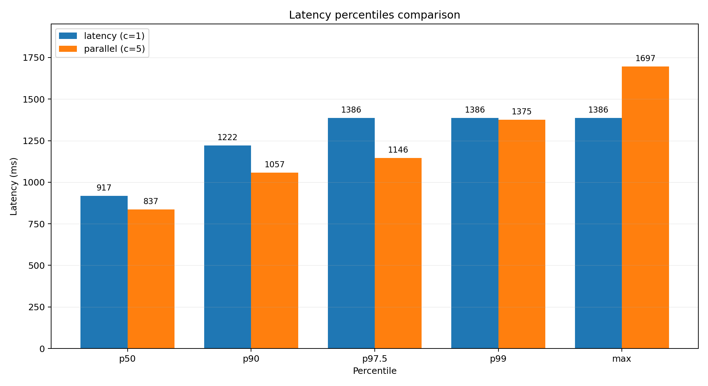
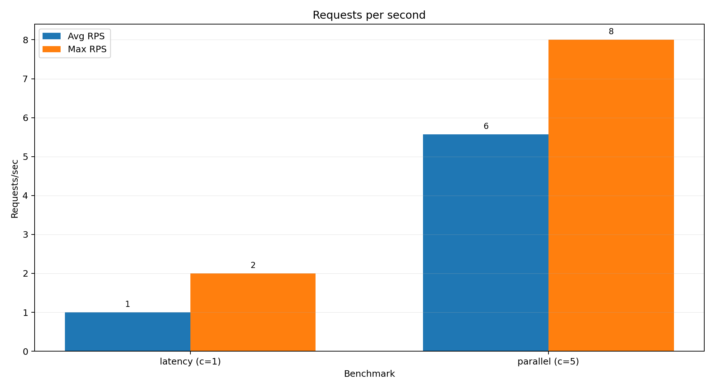
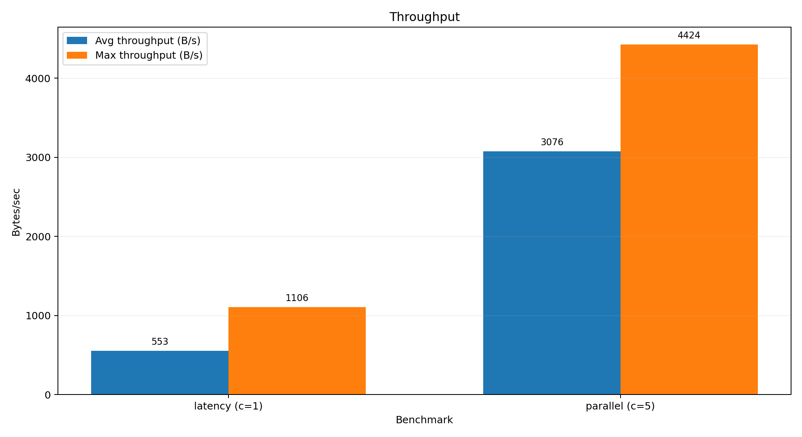

# UniSupport Chatbot

A consultative/helpdesk web application for university-related public information.
  
The system provides a chat UI where users can ask questions in natural language. On the backend, requests are processed through an LLM with a Retrieval-Augmented Generation (RAG) pipeline that injects relevant fragments from an internal knowledge base into the prompt to reduce hallucinations and keep answers grounded.

The application is intended for **students, applicants, and university staff**. All end users have the same access rights because the assistant works only with **publicly available** university information. Administrative actions (switching an LLM provider and updating the knowledge base) are performed through server configuration and content updates rather than a separate admin web interface.

## Tech stack

- **Backend:** Node.js, Express
- **Frontend:** React
- **LLM providers:** configurable via `.env` (e.g., OpenAI / Gemini)
- **RAG:** retrieval from the internal knowledge base, then prompt composition

---

## How to start

### Server (backend)

1. Navigate to the backend folder:
   ```bash
   cd ./backend
   ```
2. Install dependencies:
   ```bash
   npm i
   ```
3. Configure server in `.env`:
   - `GEMINI_API_KEY`
   - `OPENAI_API_KEY`
   - `PROVIDER_TYPE` (selects the active provider)
   - `CORS_ORIGIN` (list of allowed origins, http://localhost:3000 for dev)
   - `RATE_LIMIT_WINDOW_MS` (60000)
   - `RATE_LIMIT_MAX` (60)

4. Start the server:
   ```bash
   npm run dev
   ```

### Client (frontend)

1. Install dependencies in the client folder:
   ```bash
   npm i
   ```
2. Run the client:
   ```bash
   npm run dev
   ```

---

## Benchmarks

The repository includes benchmark outputs generated with `autocannon` and rendered into charts and a summary table.

They can be run using
```bash
   cd ./backend
   npm run bench:latency
   npm run bench:parallel
```

### Latency percentiles


### RPS


### Throughput


### Summary table
See: [docs/bench/bench-summary.md](docs/bench/bench-summary.md)
